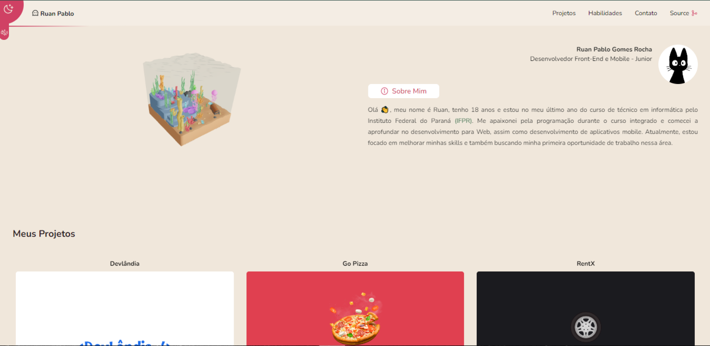

# Me-Encoded

## Web Portfolio ❤
https://me-fixruan.vercel.app/

<br />

## Capa

 <br/> <br/>

## Stack

- React
- Typescript
- Tailwind css
- Email JS
- Three Js
- React-three-fiber
- Context API
- Yup
- Aos
- Phosphor-react
- vite

## Aprendizados

- Compressão e importação de arquivos GLB
- Corversão de 3d para o React Fiber
- Formulário com Email-JS
- Animações com Aos

## Design da aplicação

- Clique [aqui](https://www.figma.com/file/jvyXTY1oTe0KZqadBthS4q/Port?node-id=0%3A1) para acessar o layout no Figma

## Como executar a aplicação

### Instalação

1. Clone o repositório

```bash
git clone https://github.com/FixRuan/Me-Encoded
```

2. Acesse a pasta do projeto

```bash
cd Me-Encoded
```

3. Instale as dependências necessárias

```bash
yarn
```

4. Execute o projeto

```bash
yarn dev
```
